# Architecture

Overview of Zero Ichi's internal architecture and project structure.

## Project Structure

```
zero-ichi/
├── config.schema.json          # Runtime config schema
├── CONTRIBUTING.md             # Canonical contribution guide
├── docs/                       # VitePress docs site
├── src/
│   ├── main.py                 # CLI entrypoint + bot bootstrap
│   ├── dashboard_api.py        # FastAPI dashboard/backend API
│   ├── ai/                     # AI agent, memory, context, skills
│   ├── commands/               # Auto-discovered command modules
│   ├── config/                 # Static app settings
│   ├── core/                   # Runtime internals
│   │   ├── client.py           # WhatsApp client wrapper
│   │   ├── command.py          # Command loader/base types
│   │   ├── config_ops.py       # Shared config mutation helper
│   │   ├── db.py               # SQLAlchemy persistence layer
│   │   ├── middlewares/        # Message pipeline
│   │   ├── permissions.py      # Role/owner/admin checks
│   │   ├── runtime_config.py   # Live config + history/rollback
│   │   ├── storage.py          # DB-backed scoped storage
│   │   ├── webhooks.py         # Outgoing webhook worker
│   │   └── handlers/           # Event handlers
│   └── locales/                # Translation files
├── data/                       # Runtime DB/history/media caches
└── logs/                       # Log files
```

## Core Modules

### Message Flow

```
WhatsApp -> Neonize -> src/main.py -> Middleware Pipeline -> Command Loader -> Command.execute()
```

1. **Neonize** receives the WhatsApp message
2. **`src/main.py`** wraps it in a `MessageHelper` and passes it through the middleware pipeline
3. **Middleware** runs in sequence and can stop pipeline early
4. **Command Loader** matches the prefix + command name
5. **Permissions** are checked (role override, admin, owner, bot-admin, rate limit)
6. **Command.execute()** runs the command logic

### Middleware Pipeline

Zero Ichi uses a middleware pipeline to process messages before command execution.

```mermaid
graph LR
    A[Message] --> B[Self Mode]
    B --> C[Stats]
    C --> D[Auto Actions]
    D --> E[Anti-Delete]
    E --> F[Blacklist]
    F --> G[Anti-Link]
    G --> H[Mute]
    H --> I[Anti-Spam]
    I --> J[Feature Gates]
    J --> K[Automations]
    K --> L[Auto Download]
    L --> M[Download Reply]
    M --> N[AI]
    N --> O[Command Execution]
```



Each middleware can mutate context or stop processing early.

### Event System

The bot uses an event-driven architecture for features like:

-   **`on_message`** — Triggered for every incoming message.
-   **`on_group_participant_update`** — Welcome/Goodbye messages.
-   **`on_call`** — Auto-block incoming callers (optional).

Handlers are registered in `src/core/handlers/` and loaded by `src/main.py`.

### Command System

Commands are Python classes that inherit from `Command`:

```python
class Command:
    name: str               # Command name
    aliases: list[str]      # Alternative names
    description: str        # Help text
    usage: str              # Usage example
    group_only: bool        # Group-only command
    private_only: bool      # DM-only command
    admin_only: bool        # Requires group admin
    owner_only: bool        # Requires bot owner
    bot_admin_required: bool  # Bot must be group admin
    cooldown: int           # Seconds between uses
```

Commands are auto-discovered from `src/commands/*/` directories.

Recent owner/runtime additions built on top of this system:

- `/setup` for guided first-run config
- `/permission` for role overrides per command
- `/privacy` for retention and AI memory controls
- `/config history` and `/config rollback <id>` for config recovery

### Storage

Runtime state uses a SQL database through `core/db.py`:

- Default: SQLite at `data/zeroichi.db`
- Optional: PostgreSQL when `DATABASE_URL` is set

`core/storage.py` keeps a simple API over DB-backed persistence:

```python
from core.storage import GroupData

storage = GroupData(chat_jid)
storage.save("rules", {"text": "Be kind!"})
rules = storage.load("rules", {"text": ""})
```

Other runtime modules (`scheduler`, `analytics`, `token_tracker`, `afk`, `i18n` chat language state, AI memory) are also persisted in the database.

`runtime_config.py` merges user config with defaults, backfills newly added
keys, validates against `config.schema.json`, and records config history for
rollback.

### Webhooks

`core/event_bus.py` emits internal events for dashboard live updates and webhook fanout.

`core/webhooks.py` subscribes to emitted events asynchronously and delivers them to configured endpoints with:

- HMAC signature headers
- retry/backoff on failures
- delivery logs stored in DB (`webhook_deliveries`)
- auto-disable after configurable failure threshold

Incoming webhooks are exposed via dashboard API endpoint `POST /api/incoming-webhook/{token}` with:

- HMAC signature validation
- per-key allowed actions
- per-key rate limits
- idempotency key deduplication

Audit entries for sensitive operations are stored in `audit_logs` and surfaced in dashboard.

### JID Resolver

WhatsApp uses two ID formats: **PN** (phone number) and **LID** (linked ID). The JID resolver handles conversion between them:

```python
from core.jid_resolver import jids_match, resolve_pair

if await jids_match(jid1, jid2, client):
    print("Same user!")
```
